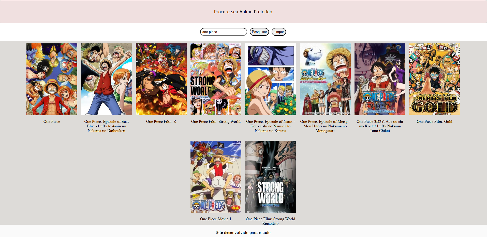

## Site de buscar animes
Projeto criado para estudos usando HTML, CSS, JavaScript com implementação de uma API publica
(https://kitsu.docs.apiary.io/#introduction/authentication/app-registration) para pesquisar seus animes preferidos com facilidade
<div align="center">
  
  <b>`プ ロ グ ラ マ`</b>
  <br>
  <samp>
      Hi there! I'm <b>Valakzz</b> 👋
      <br>
      Kotlin • Back-end • Dev in progress
  </samp>
  #

</div>

### Design do Projeto

#
Detalhes do uso da APi
```
https://kitsu.io/api/edge
```
Site online via git pages
```
https://valakzz.github.io/Projeto-Anime/
```

#
## ✅ Funcionalidades Implementadas
- [x] Botão para busca rápida
- [x] API Integrada
- [x] Todos anime relacionados com a pesquisa aparecendo

## 🚀 Próximas Melhorias

- [ ] Buscar por Gênero  
- [ ] Buscar por Data
- [ ] Implementação dos mais assistidos da temporada


